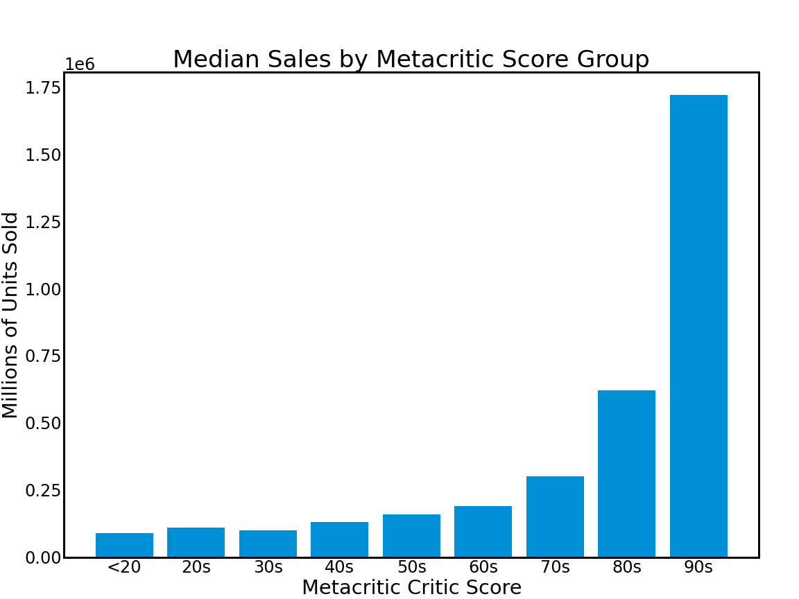

# Video Games and Machine Learning

by Jacob Prebys

### Repository Contents

📁 **data** 
    - Contains all data files needed to reproduce my work

📁 **notebooks**
        - All Jupyter Notebooks used for gathering and exploring data, as well as modeling work 

📁 **report** - Final Jupyter Notebook is located [here](./report/final_report.ipynb) as well are the [presentation slides](./report/final_presentation.pptx)

📁 **src** - All images used and produced in this project, and all Python scripts

📝 **LICENSE** - Usage information

📝 **environment.yml** - Contains all packages required to run the code in this project

### Overview

Here is a project where I will use natural language processing and other techniques in an attempt to find predictive features for the critical success of a game. As video games become more expensive to make and require larger teams of developers, it is important to understand what about the content of a video game makes it successful. Here I will take video game review scores and pair them with Wikipedia descriptions to attempt to find a connection between the features of a game and its reception.

### Critical Reception vs Global Sales

My original idea was to use this modeling to target global sales figures, but I decided to instead focus on critical reception for a few reasons. First, critics review games on the same scale: for the Metacritic data that I gathered these scores range from 0 to 100. This is useful because for different sized game studios, the thresholds for commercial success are very different. Second, there is a clear link between Metacritic score and global sales, which you can see below 

### Data Acquisition

The first place I acquired my data from is [VGChartz](https://www.vgchartz.com/gamedb/). This is a useful game database that has review scores, release dates, platform, ratings, and sales figures.

My second significant data source was the Wikipedia API. I accessed this through the available Wikipedia python module. From here I gathered gameplay descriptions and plot synopses for each game that I could access through that system. After this I was left with about 5,500 complete game entries.

### Data Processing

For the processing I did some standard NLP document preprocessing. I adjusted case, removed punctuation, and removed stopwords. I have just been using the standard stopword list included with the NLTK library, but I would still like to explore some more comprehensive video-game specific stop-word lists.

### Modeling

I started off with a baseline model that involved a count-vectorizer and a support vector classifier. With this first model I achieved about 45% accuracy across the three classes. From there I switched to the more sophisticated TF-IDF vectorizer that takes into account not only the frequency of a word in a document, but also penalizes that word for appearing too frequently across all documents. This improved my model performance to about 60% accuracy. Through hyper-parameter tuning I was able to achieve a maximum accuracy of about 65%.

### Evaluation

While an accuracy of 65% is not great, it does suggest that there is some connection to be uncovered about the description of a video game and its critical reception. I am confident that with further exploration this result can be improved significantly. 

### Future Improvement Ideas

First of all, I would like to get some better model performance. To do this I should really examine the contents of my corpus more closely. Things to explore are:

1. Making a more comprehensive stop-word list
2. Extracting the features from my model to determine what exactly determines a 'good' game

Additionally, once I have a model that can sufficiently process the content of a game in this way, I would like to roll it into a content-based recommendation system. This app can be deployed through Dash and accessible via Heroku.

### Reproduce the Results!
1. Clone this repo (for help see this [tutorial](https://help.github.com/articles/cloning-a-repository/)).

2. Load the provided [Conda Environment](./environment.yml). Use ``conda env create --file environment.yml`` to load the file into a new environment.

3. You are all set to reproduce and add to the results on your own! 

### Contact Info

|  Github |        Email        | LinkedIn |
|:-------:|:-------------------:|:--------:|
| jprebys | jacobprebys@gmail.com |  jprebys |  
  
    
    
  

*Header Image by Ivan_Shenets / Shutterstock*
