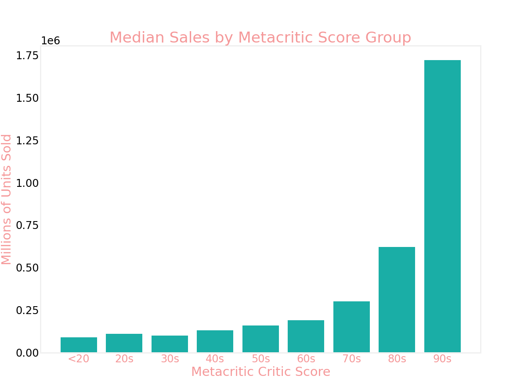

# Video Games and Machine Learning

by Jacob Prebys

### Repository Contents

📁 **data** 
    - Contains all data files needed to reproduce my work

📁 **notebooks**
        - All Jupyter Notebooks used for gathering and exploring data, as well as modeling work 

📁 **report** - Final Jupyter Notebook is located [here](./report/final_report.ipynb) 

📁 **src** - All images used and produced in this project, and all Python scripts

📝 **LICENSE** - Usage information

### Overview

Here is a project where I will use natural language processing and other techniques in an attempt to find predictive features for the critical success of a game. As video games become more expensive to make and require larger teams of developers, it is important to understand what about the content of a video game makes it successful. Here I will take video game review scores and pair them with Wikipedia descriptions to attempt to find a connection between the features of a game and its reception.

### Critical Reception vs Global Sales

My original idea was to use this modeling to target global sales figures, but I decided to instead focus on critical reception for a few reasons. First, critics review games on the same scale: for the Metacritic data that I gathered these scores range from 0 to 100. This is useful because for different sized game studios, the thresholds for commercial success are very different. Second, there is a clear link between Metacritic score and global sales, which you can see below 

### Data Acquisition

The first place I acquired my data from is [VGChartz](https://www.vgchartz.com/gamedb/). This is a useful game database that has review scores, release dates, platform, ratings, and sales figures.

My second significant data source was the Wikipedia API. I accessed this through the available Wikipedia python module. 
